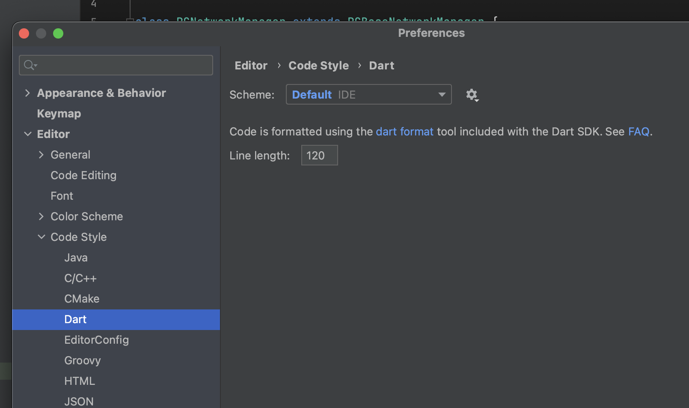

# pivot_chat

Pivot Studio 打造的聊天软件。

## Getting Started

### Set up your environment

Fork the xhzq233/pivot_chat repo into your own GitHub account.

Clone the forked repo locally using the method of your choice. GitHub Desktop is simplest.

If you cloned the repo using SSH, you'll need to configure the upstream remote for xhzq233/pivot_chat. This will allow you to sync changes made in xhzq233/pivot_chat with the fork:

- cd pivot_chat
- Specify a new remote upstream repository (xhzq233/pivot_chat) that will be synced with the fork.
  SSH: git remote add upstream git@github.com:xhzq233/pivot_chat.git
- Verify the new upstream repository you've specified for your fork.
  `git remote -v`

Then you can commit and push your changes to your forked repo and create a pull request to xhzq233/pivot_chat.

let's start coding🚀!

### Set up your editor

`dart format` change to -l120



## Dependencies

- 使用[go_router](https://pub.dev/packages/go_router)作为路由框架
- 使用[flutter_bloc](https://pub.dev/packages/flutter_bloc)作为状态管理框架
- 使用[dio](https://pub.dev/packages/dio)作为网络请求框架
- 使用[build_runner](https://pub.dev/packages/build_runner)
  作为代码生成工具，主要是用于json序列化，配合[json_serializable](https://pub.dev/packages/json_serializable)
  使用，[json_annotation](https://pub.dev/packages/json_annotation)作为注解
- 使用[flutter_screenutil](https://pub.dev/packages/flutter_screenutil)作为屏幕适配框架
- 使用[flutter_easyrefresh](https://pub.dev/packages/easy_refresh)作为下拉刷新框架
- 使用[flutter_smart_dialog](https://pub.dev/packages/flutter_smart_dialog)作为弹窗框架
- 统一使用[cached_network_image](https://pub.dev/packages/cached_network_image)
  作为网络图片加载框架，本地图片资源尽量使用svg格式（可以和设计提出），使用[flutter_svg](https://pub.dev/packages/flutter_svg)
  作为svg加载框架
- 数据库暂不考虑，如果使用可以考虑[hive](https://pub.dev/packages/hive)
- 使用[flutter_cache_manager](https://pub.dev/packages/flutter_cache_manager)作为缓存框架

## 项目结构

- lib/theme.dart：主题配置，设计给出
- lib/assets.dart：资源文件，包括图片、颜色、字体等，如
  `const kPCLogo = 'assets/images/logo.png'`
- lib/widget: 通用组件，以**PC**开头，代表Pivot Chat，如PCNetworkImage
- lib/manager: 通用管理类，以**PC**开头，如PCImageCacheManager
- lib/util: 通用工具类，以**PC**开头，如PCImageUtil
- lib/pages/xxx: 页面，以**PC**开头，如PCLoginPage
  - lib/pages/xxx/bloc: 页面的bloc，以**PC**开头，如PCLoginPageBloc
  - lib/pages/xxx/model: 页面的model，以**PC**开头，如PCLoginModel
  - lib/pages/xxx/widget: 页面的组件，一般不需要导出，以`_`开头，如\_PCLoginButton，以part形式导入到page.dart中


### WIP

> module模板

modules/widget: 更加通用的组件，可跨项目使用，俗称**轮子**，自己按照功能命名
modules/util: 同上

## 代码规范


参考[https://dart.cn/guides/language/effective-dart/style](https://dart.cn/guides/language/effective-dart/style)

### log规范

#### 什么地方应该打日志？

- 业务关键路径，例如支付流程中，用户点击支付请求->客户端请求Apple支付->Apple回调请求结果->请求业务后台->业务后台回包->调用苹果服务完成支付，这里的每一步都应该打日志（并且需要带上关键的参数），这样才能在用户反馈问题的时候快速缩小排查范围（例如发现后台回包报错，在确认请求体没有问题的情况下可以快速交给后台排查），在满足下面要求的前提下日志点越丰富越好。
- 复杂逻辑实现中，例如输入框的状态转换
- 用户行为操作，例如点击按钮、切换语言、退出登录等等，建议把所有用户操作点击行为触发处都加上日志，可以复现用户操作步骤，从而本地复现问题（双击、快速切换之类的问题；“明明没有删除”之类的问题）

#### 什么地方不应该打日志？

- 超高频调用中（最典型的，Flutter的build方法）
  - 如果实在要打，在某个值变化时才打，或者加频控
- 用户敏感信息（聊天记录，手机号，密码等）

#### 打什么样的日志

- TAG
- 注意区分等级verbose/debug/info/warning/error 每一级都有自己的作用，其中verbose和debug发布时不会输出，所以仅本地调试的日志一定不能高于info级别
- catch的error信息一定要带上exception以及堆栈

### Debug

- 使用`debugPrint`打印你在修复bug时的日志，而不是`print`，因为`debugPrint`可以在release模式下不打印日志，修复完了记得要去掉
- 尽量使用assert来保证你所认为的代码的正确性，例如：

```dart
// Here I assume the image size should be greater than 0
assert(_kDefaultImageSize > 0);
```

### Commit规范

- Commit提交前确保能编过（特殊情况合作解决编译问题除外）
- Commit粒度尽量细，尽量不要出现特大Commit
- 养成勤拉分支的习惯，做新的东西拉新的分支；

## Ignore

默认ignore了**/*.g.dart，避免代码提交时冲突，副作用是需要手动运行`dart pub run build_runner build`来生成代码

## 状态管理

### bloc与manager的区别

一个在widget树中，一个不在

### 为什么使用flutter_bloc

- 树状结构，契合Flutter的Widget树

## 编写网络API

见/lib/manager/network/pc_network_manager.dart中的example